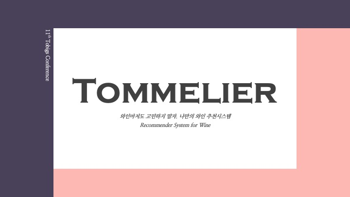

# Tommelier



투믈리에는 와인 추천 시스템으로, 와잘알(와인을 잘 아는 사람)과 와못알(와인을 잘 모르는 사람)이라는 사용자의 특징을 고려한 추천 시스템입니다.
<br>
투믈리에는 [투빅스 11회 컨퍼런스](https://www.youtube.com/channel/UCo1MBYfcQ1P9UOGqgW4GNTQ/featured)에서 소개되었으며, [발표 자료]()와 [웹 페이지](http://tommelier.ml/)를 통해서 더욱 자세한 사항을 확인할 수 있습니다.
<br>
와인 추천을 위해 사용된 데이터는 [vivino](https://www.vivino.com/FR/en/)에서 크롤링을 통해 수집하였습니다.


## 1. Data

프로젝트에서 대표적으로 다룬 데이터는 user meta, item meta, user-item rating 데이터입니다.
<br>
자세한 명세는 [구글 스프레드 시트](https://docs.google.com/spreadsheets/d/1Myp9Oe9B3fByzJjSmSNaqxhyCgYKLTSYc0NgZUHcxUw/edit?usp=sharing)에서 확인 가능합니다.


## 2. Model

|Model|Hyper Params|Epochs|Roc|Acc|담당자|
|-----|--------|---|---|---|---|
|DCN|Cross(2) + Deep(512, 256, 128, 64)|1000(78)|0.9582|0.93|오진석|
|DCN|Cross(1) + Deep(256, 128, 64)|1000(276)|0.9528|0.92|오진석|
|DCN|Cross(1) + Deep(192, 192)|500(202)|0.9565|0.93|박준영|
|DeepFM|Embedding size(4)|100|0.87|0.8|장혜림|
|DeepFM|Embedding size(20)|100|0.9168|0.845|정세영|
|DeepFM|BN, Dropout, Embedding size(32)|500(235)|0.9261|0.8494|정세영|
|NeuralMF|Deep(256, 128, 64, 32)|100|0.8917|0.81|조상연|

|Model|Hyper Params|Epochs|Recall|HitRate|담당자|
|-----|-------------|---|---|---|---|
|SVD|||0.476|0.854|조상연|
|GCN|Restart probability = 0.3      <br> Num random walks = 10 <br> Num neighbors = 3 <br> Hidden dims = 512     |500|0.466|0.916|신윤종|
|GCN|Restart probability = 0.3      <br> Num random walks = 10 <br> Num neighbors = 10 <br> Hidden dims = 1024     |1000|0.619|0.932|신윤종|
|GCN|Restart probability = 0.3      <br> Num random walks = 10 <br> Num neighbors = 3 <br> Hidden dims = 1024     |1000|0.693|0.942|신윤종|

## 3. Web Demo

> [웹 데모](http://tommelier.ml/)를 통해 초심자도 간단한 설문만 하면 와인을 추천받을 수 있습니다.


|`Demo Screenshot`|
|--|
||


## 4. Model Reference

  - [Neural MF](https://arxiv.org/pdf/1708.05031.pdf)
  - [DeepFM](https://arxiv.org/pdf/1703.04247.pdf)
  - [DCN](https://arxiv.org/pdf/2008.13535.pdf)
  - [GCN]()


## 5. Contributors

- 12기 신윤종
- 13기 오진석
- 13기 이지용
- 13기 조상연
- 14기 박준영
- 14기 정세영
- 14기 장혜림

---------

## Structure

```python
투믈리에
├── README.md
├── Preprocess
│   ├───crawling.py
│   ├───preprocess.py
│   └───dcn_preprocess_junyoung.py
│   
├── Models
│   ├───NeuralMF.py
│   ├───DCN.py
│   └───GCN.py
│   
├── Results
│   ├──NMF_main.ipynb
│   ├──DCN_main.ipynb
│   ├──DCN_main_junyoung.ipynb
│   ├──DeepFM_main.ipynb
│   └──GCN_main.ipynb
│

```


