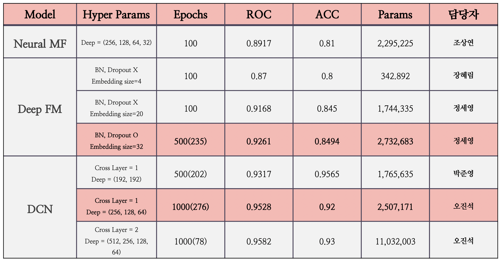
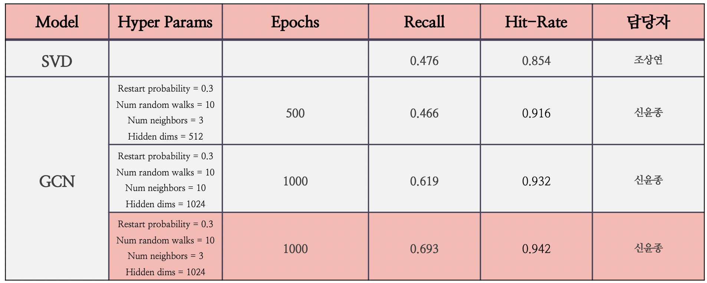

# Tommelier


투믈리에는 와인 추천 시스템으로, 와잘알(와인을 잘 아는 사람)과 와못알(와인을 잘 모르는 사람)이라는 사용자의 특징을 고려한 추천 시스템입니다.
<br>
투믈리에는 [투빅스 11회 컨퍼런스](https://www.youtube.com/channel/UCo1MBYfcQ1P9UOGqgW4GNTQ/featured)에서 소개되었으며, [발표 자료]()와 [웹 페이지](http://tommelier.ml/)를 통해서 더욱 자세한 사항을 확인할 수 있습니다.
<br>
와인 추천을 위해 사용된 데이터는 [vivino](https://www.vivino.com/FR/en/)에서 크롤링을 통해 수집하였습니다.


## 1. Data

프로젝트에서 대표적으로 다룬 데이터는 user meta, item meta, user-item rating 데이터입니다.
<br>
자세한 명세는 [구글 스프레드 시트](https://docs.google.com/spreadsheets/d/1Myp9Oe9B3fByzJjSmSNaqxhyCgYKLTSYc0NgZUHcxUw/edit?usp=sharing)에서 확인 가능합니다.


## 2. Model






## 3. Web Demo

> [웹 데모](http://tommelier.ml/)를 통해 초심자도 간단한 설문만 하면 와인을 추천받을 수 있습니다.


|`Demo Screenshot`|
|--|
||


## 4. Model Reference

  - [Neural MF](https://arxiv.org/pdf/1708.05031.pdf)
  - [DeepFM](https://arxiv.org/pdf/1703.04247.pdf)
  - [DCN](https://arxiv.org/pdf/2008.13535.pdf)
  - [GCN]()


## 5. Contributors

<!-- ALL-CONTRIBUTORS-LIST:START - Do not remove or modify this section -->
<!-- prettier-ignore-start -->
<!-- markdownlint-disable -->
<table>
  <tr>
    <td align="center"><a href="https://github.com/csy1204"><br /><sub><b>조상연</b></sub></a><br /><a href="https://github.com/csy1204" title="Code">💻</a></td>
    <td align="center"><a href="https://github.com/jinseock95"><br /><sub><b>JinSeok Oh</b></sub></a><br /><a href="https://github.com/cryingjin/Shopping_GG/commits?author=jinseock95" title="Code">💻</a></td>
    <td align="center"><a href="https://github.com/cryingjin"><br /><sub><b>YeJin Lee</b></sub></a><br /><a href="https://github.com/cryingjin/Shopping_GG/commits?author=cryingjin" title="Code">💻</a></td>
    <td align="center"><a href="https://github.com/jbeen2"><br /><sub><b>JaeBeen Lee</b></sub></a><br /><a href="https://github.com/cryingjin/Shopping_GG/commits?author=jbeen2" title="Code">💻</a></td>


---------

## Structure

```python
투믈리에
├── README.md
├── Preprocess
│   ├───crawling.py
│   ├───preprocess.py
│   └───dcn_preprocess_junyoung.py
│   
├── Models
│   ├───NeuralMF.py
│   ├───DCN.py
│   └───GCN.py
│   
├── Results
│   ├──NMF_main.ipynb
│   ├──DCN_main.ipynb
│   ├──DCN_main_junyoung.ipynb
│   ├──DeepFM_main.ipynb
│   └──GCN_main.ipynb
│

```


